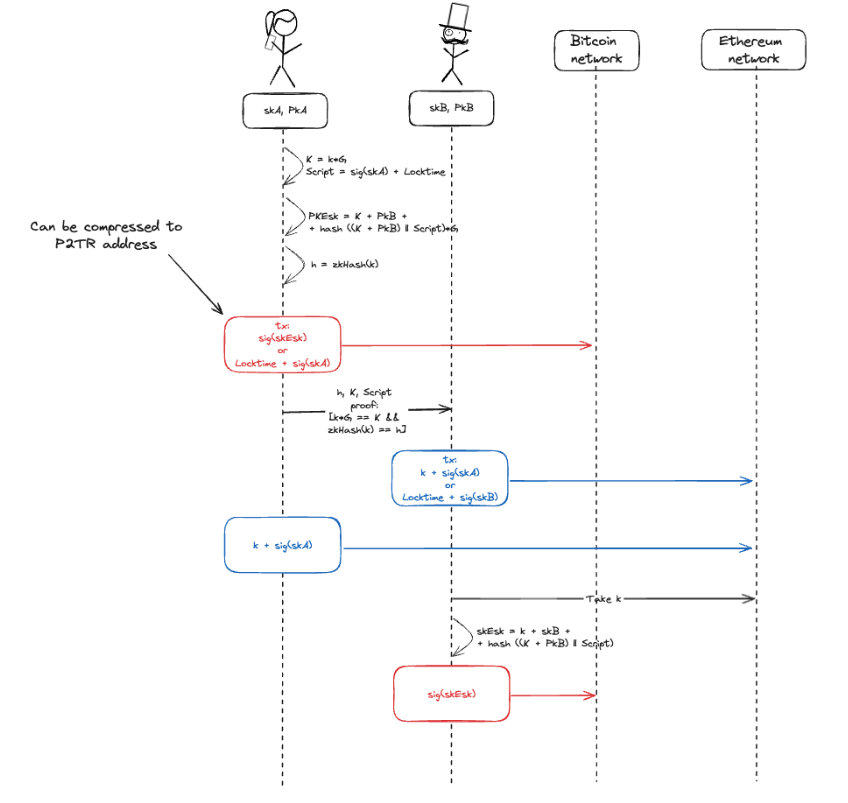

# <p style="text-align: center;"> Taprootized Atomic Swaps </p>

Taprootized Atomic Swaps (TAS) is an extension for Atomic Swaps that presumes the untraceability of 
transactions related to a particular swap. Based on Schnorr signatures, Taproot technology, and
zero-knowledge proofs, the taprootized atomic swaps hide swap transactions under regular payments.

## Intro
Atomic swap is an incredible approach to cross-chain exchanges without mediators. However, one of 
the disadvantages of its implementation in the classical form is the “digital trail” — any party 
can make a matching between transactions in the blockchains in which the exchange took place and
find out both the participants in the exchange and the proportion in which assets were exchanged.

<div align="center">

</div>

On the other hand, atomic swaps is a technology that initially assumed the involvement of only two 
parties and a “mathematical contract” between them directly. That is, an ideal exchange presupposes 
2 conditions:
1) Only counterparties participate in the exchange (works by default)
2) Only counterparties know about the fact of the exchange (it would be nice to ensure)

This paper will provide a concept of taprootized atomic swaps that allow hiding the swap's very fact. To an
external auditor, transactions to initiate and execute atomic swaps will be indistinguishable from regular Bitcoin
payments. In the other accounting system involved in the transfer, more information is disclosed (the fact of
exchange can be traced). Still, it is impossible to link this to the corresponding Bitcoin transactions (without
additional context from the involved parties).

<div align="center">

</div>

### The protocol includes the following steps:
1. Alice (`skA`, `PKA`) and Bob (`skB`, `PKB`) have their keypairs and know each other's public keys.
2. Alice generates a random `k` and calculates the public value `K = k * G`
3. Alice forms the alternative spending path `Script = sig(skA) + Locktime` in the form of Bitcoin Script 
4. Alice calculates an escrow public key as `PKEsc = K + PKB + hash((K + PKB) || Script) * G` (here,
   escrow is just a public key, formed using Taproot technology
   1. The signature `sig(skEsc)`, verified by thr `PKEsc`, can be generated only with the knowledge of `k`, `skB` and `Script`
5. Alice calculates the `h` as a hash value of `k` (zk-friendly hash function is recommended to use)
6. Alice forms the funding transactions with the following conditions of how it can be spent:
   1. Signature of `skEsc`: Bob, with knowledge of `k` and `skB` can spend the output
   2. Signature of `skA` + Locktime: Alice, with knowledge of `skA` can spend the output, but only after some point in time `t1` (it's the `Script` itself)
7. Alice sends the transaction to the Bitcoin network
8. Alice generates the zero-knowledge `proof` that includes:
   1. The proof of knowledge of `k` that satisfies `k * G == K`
   2. The proof of knowledge of `k` that satisfies `zkHash(k) == h`
9. Alice provides the set of data to Bob:
   1. `h`
   2. `K`
   3. `Script`
   4. `proof`
10. Bob calculates `PKEsc` as `K + PKB + hash((K + PKB) || Script) * G` and finds the transaction locked BTC (verifies it exists). Then Bob performs the following verification:
    1. Verifies that Alice knows `k` that satisfies `k*G == K` and `zkHash(k) == h`, it means that Bob can access the output `PKEsc` if he receives `k`
    2. Verifies that the `Script` is correct and includes only the required alternative path.
11. If verifications are passed, Bob forms the transaction that locks his funds on the following conditions:
    1. Publishing of `k` and the signature of `skA`: only Alice can spend it if she reveals `k` (hash preimage)
    2. Signature of `skB` + Locktime: Bob, with knowledge of `skB`, can spend the output, but only after some point in time `t2`
12. Bob sends the transaction to the Ethereum network (or any other that supports `zkHash()`)
13. Alice sees the locking conditions defined by Bob and publishes the `k` together with the signature generated by her `skA`. As a result - Alice spent funds locked by Bob.
    1. If Alice doesn’t publish the relevant `k`, Bob can return funds after locktime is reached
14. If Alice publishes a transaction with `k`, Bob can recognize it and extract the `k` value
15. Bob calculate the needed `skEsc` as `skEsc = k + skB + hash((K + PKB) || Script)`
16. Bob sends the transaction with the signature generated by the `skEsc` and spends funds locked by Alice.
---
## The first taprootized atomic swap between Bitcoin and Ethereum mainnets

Transactions:
1. Alice locks BTC: 850e9258bf8b3bb280d32a647198d8024aece543dc283f7bfa526f4c0ceb1ab8
2. Bob locks ETH: 723919c0e8ec57d38792ec29b2cb82ee885b9fbbc886b34ff40fb5d3f7cc9b43
3. Alice withdraws ETH from the contract: 47546191a7c99ec4a7ddc243d6ea75d345ab3aff0762e09dd2f537731bd484f3
4. Bob spends BTC: 859dbfaa901d7106aecc8cb29966ede0c9d7a17c2cae31f4d420c1d770e9706d
---

## A bit about the repository
This repository provides all components for executing an atomic swap, including a script for an 
Ethereum-Bitcoin exchange between Alice and Bob.

- `circuits`: Contains [`Circom`](https://docs.circom.io/) circuits for Zero-Knowledge proof 
  creation in step eight of the outlined flow. These circuits verify the knowledge of a private 
  256-bit scalar `k`, where `K = k * G` and `h = Poseidon(k)`, with `K` and `h` being public, 
  `Poseidon` being the hash function, and `G` representing the Secp256k1 base point.
- `contracts`: Contains the `Depositor` contract in Solidity designed for depositing
  native currency using a 256-bit number `h` and `locktime`, locking funds with two withdrawal 
  conditions:
  - Spender knows some `k` that `h = Poseidon(k)`- money goes to the message sender
  - `locktime` has passed - money goes to the deposit maker
- `crates`: Contains Rust crates for ZkSnark witness, proof generation, and validation. Proof 
  generation currently takes about 13 seconds on an M1 Pro chip, with witness calculation 
  accounting for 10 seconds. Utilizing `c++` bindings instead of the existing `wasm` witness
  calculator can notably reduce this time.
- `src`: Contains the Rust script for facilitating an atomic swap between Alice and Bob. It 
  encompasses all steps outlined in the documentation, including proof generation, taproot 
  transaction creation, and executing transactions on both Bitcoin and Ethereum networks.
- `scripts`: Contains auxiliary scripts for Circom and SnarkJS.

## How to try it out?
You can use either testnets for Ethereum and Bitcoin networks or run the local test networks by 
using such utilits as [`ganache`](https://trufflesuite.com/ganache/) for Ehtereum and 
[`nigiri`](https://nigiri.vulpem.com/) for Bitcoin.

You can use this deployed, verified and ready for use contracts:
- Ethereum mainnet: [`0x936f971455bc674F77312f451963681fe964E838`](https://etherscan.io/address/0x936f971455bc674f77312f451963681fe964e838)
- Sepolia testnet: [`0x85BEaB7f80B375175BeCC3f68Bf86d33099fD576`](https://sepolia.etherscan.io/address/0x85BEaB7f80B375175BeCC3f68Bf86d33099fD576)

You can use trusted setup files (`.ptau`, at least 17th power) from [`SnarkJs`] repository, you
can find it in the readme section, for ZK proof generation.

#### Steps: 
0. Install [`Cargo`](https://doc.rust-lang.org/book/ch01-01-installation.html#installation), 
   [`Circom`](https://docs.circom.io/getting-started/installation/), 
   [`SnarkJS`](https://docs.circom.io/getting-started/installation/#installing-circom)
1. Setup `config.toml`. Check the config.example.toml for example, it has detailed description.
2. Compile atomic-swap executable:
   ```bash
   cargo install --path .
   ```
3. Run the script with the config that is configured for section 2:
   ```bash
   taprootized-atomic-swap config.toml
   ```
   
### Build for Linux
Before compiling make sure, that you have the OpenMP installed on your device. It is required 
dependency to build the `rapidsnark-sys` crate.
```bash
sudo apt update sudo apt upgrate
sudo apt install libomp-dev
```